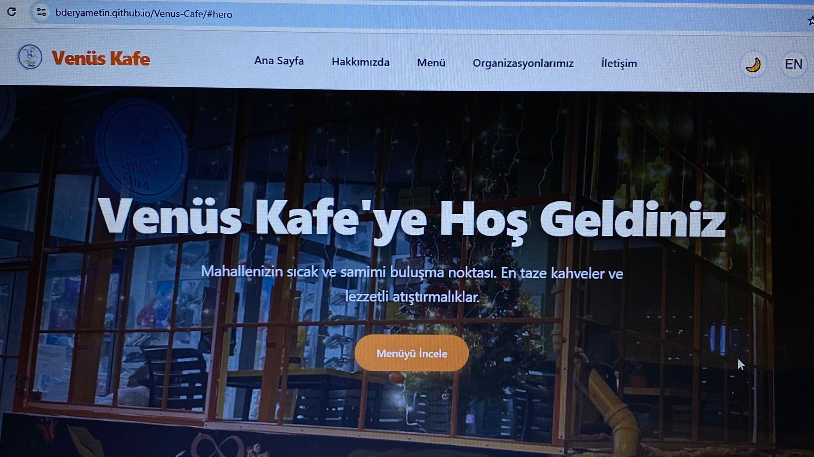
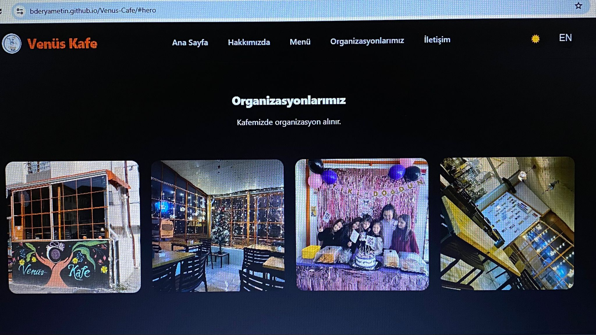
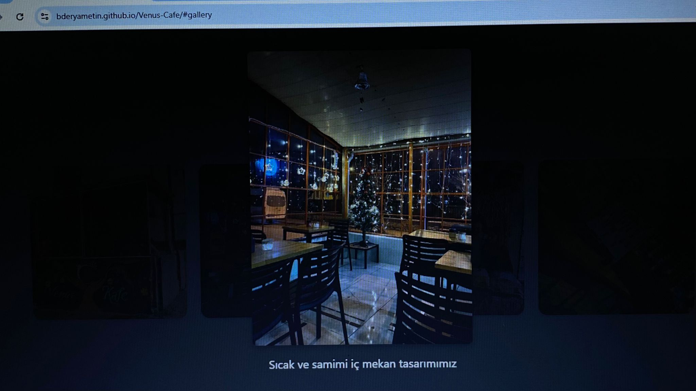

# Venüs Kafe - Modern Esnaf Kafesi Web Sitesi

Bu proje, final ödevi gereksinimleri doğrultusunda **Venüs Kafe** için geliştirilmiş modern, şık ve turuncu renk paletine sahip bir tanıtım web sitesidir (One-Page).

## 📌 Müşteri Bilgisi
Venüs Kafe, samimi bir mahalle kültürünü modern bir yaklaşımla sunan bir esnaf kafesidir. Günlük taze çekilmiş kahveler ve ev yapımı tatlılar sunar.

## 🚀 Kullanılan Teknolojiler
- **Semantik HTML5:** SEO ve Erişilebilirlik (WCAG 2.2 AA) odaklı kodlama.
- **Modern CSS:** Flexbox ve Grid ile responsive tasarım (Float kullanılmamıştır).
- **Vanilla JavaScript:** Mobil menü, Dark Mode, Çoklu Dil ve Scroll animasyonları.
- **Görsel Optimizasyonu:** Node.js Sharp kütüphanesi ile tüm görseller WebP formatına dönüştürüldü.
- **Formspree:** İletişim formu entegrasyonu.

## 🔗 Canlı Site ve Lighthouse
- Canlı Site Linki: [https://bderyametin.github.io/Venus-Cafe/](https://bderyametin.github.io/Venus-Cafe/)
- (Lighthouse skorları PDF raporunda mevcuttur. Erişilebilirlik ve Performans odaklı tasarlanmıştır.)

## 📷 Ekran Görüntüleri

### Ana Sayfa

### Karanlık Mod

### Etkinlik ve Organizasyon

## 📂 Klasör Yapısı
- `css/` : Stil dosyaları (CSS değişkenleri ve dark mode içerir).
- `js/` : JavaScript dosyaları.
- `images/` : WebP formatına çevrilmiş optimize görseller ve ekran görüntüleri.
- `index.html` : Ana sayfa şablonu.

## 🎓 Geliştirme Süreci (Commit'ler)
Proje 5 aşamalı anlamlı commit'lerle inşa edilmiştir.

1. Proje iskeleti ve klasör yapısı
2. Tasarım sistemi (Renkler) ve görsel optimizasyon (WebP)
3. Semantik HTML ve Responsive CSS Layout
4. JavaScript etkileşimleri ve Form
5. Karanlık mod, çoklu dil, SEO ve Rapor.
